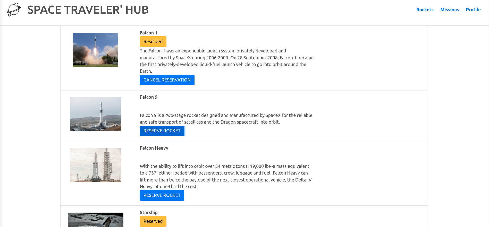

# SPACE TRAVELERS' HUB

> A web application that conects API's in order to provide the user with information and add their preffered items.




## Built With

- Javascript/HTML5/CSS3/Bootstrap
- React
- Redux

## Live Demo

[Live Demo Link](https://livedemo.com)


## Getting Started

**In this task, we worked with the real live data from the SpaceX API. Our task was to build a web application for a company that provides commercial and scientific space travel services. The application will allow users to book rockets and join selected space missions..**

To get a local copy up and running follow these simple example steps.

### Setup
```console
$ git clone git@github.com:fabianofrank/-space-travelers.git
$ cd Bookstore
$ npm install 
```

### Run it
```console
$ npm start 
```

## Authors

👤 **Author1**

- GitHub: [@angelaciuahutle](https://github.com/angelaciuahutle)
- Twitter: [@angelaCunadev](https://twitter.com/angelaCunadev)
- LinkedIn: [LinkedIn](https://linkedin.com/in/angelacuahutle)

👤 **Author2**

- GitHub: [@fabianofrank](https://github.com/fabianofrank)
- Twitter: [@fabianofrankk](https://twitter.com/fabianofrankk)
- LinkedIn: [LinkedIn](https://linkedin.com/in/fabianofrank)

## 🤝 Contributing

Contributions, issues, and feature requests are welcome!

Feel free to check the [issues page](../../issues/).

## Show your support

Give a ⭐️ if you like this project!

## 📝 License

